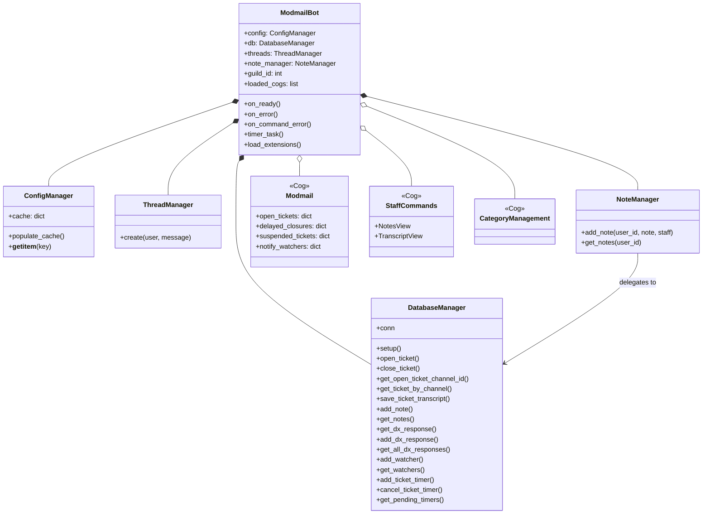
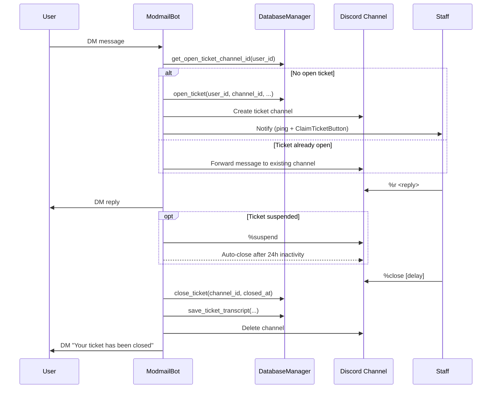
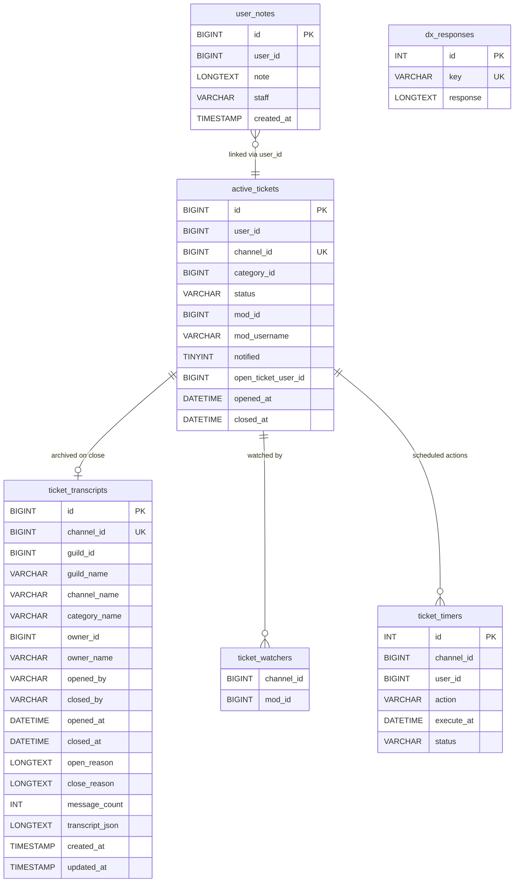

# ModMail Bot
A lightweight Discord mod-mail / ticketing bot that lets users open private ticket channels by messaging the bot. Designed for small to medium servers where staff need a clear, private way to handle user inquiries.

## Table of contents
- Overview
- Features
- Requirements
- Installation (Windows)
- Configuration
- Usage
- Bot commands
- Transcript Viewer
- Development
- Troubleshooting
- Contributing
- License
- Contact
- Changelog

## Overview
Users can DM the bot to open a private ticket channel inside a configured category. Staff can reply, move tickets between categories, and use premade replies.

## Architecture

### Class Diagram



### Ticket Lifecycle



## Features
- Ticket creation via DM
- Private ticket channels in configured categories
- Staff-only commands to reply, edit replies, move tickets
- Pre-made replies (dx)
- Config-driven (server IDs, category IDs, bot token)
- **Streamlit Transcript Viewer** — Staff-only web UI to browse, search, and filter transcripts with image rendering and internal note toggling
- **Logging** — Logs bot activity and errors to the `logs/` directory for easier debugging and monitoring.

## Requirements
- Python 3.10+ recommended
- pip
- Discord bot token (from the Discord Developer Portal)

## Installation (Windows)
1. Clone the repo:
   ```
   git clone https://github.com/VeeBuiltThat/CCAC-MousseMail-PYTHON.git
   cd CCAC-MousseMail-PYTHON
   ```
2. Create and activate a virtual environment:
   ```
   python -m venv venv
   venv\Scripts\activate
   ```
3. Install dependencies:
   ```
   pip install -r requirements.txt
   ```

## Configuration
Create or update `config/config.json` with your settings. Minimal example:
```json
{
  "token": "YOUR_BOT_TOKEN",
  "guild_id": "GUILD_ID_HERE",
  "contact_category_id": "CONTACT_CATEGORY_ID_HERE",
  "staff_role_id": "STAFF_ROLE_ID_HERE",
  "prefix": "!"
}
```
- token: Discord bot token
- guild_id: your server ID
- contact_category_id: category where tickets are created
- staff_role_id: role allowed to use staff commands
- prefix: command prefix (default: "!")

Keep your token secret. Consider using environment variables or a secrets manager for production.

## Usage
Run the bot:
```
python bot.py
```
Then:
- Users DM the bot to create tickets.
- Staff open the ticket channel in the configured category to reply.

## Commands
(for staff; prefix = configured prefix)
- `%move <category>` — Move the current ticket channel to another category.
- `%r <message>` — Reply to the user associated with the ticket.
- `%re <message>` — Edit the previous reply to the user.
- `%dx` — Show pre-made replies / canned responses.

Adjust command names and behavior to match your bot's implementation if they differ.

## Database Schema



## Transcript Viewer
A Streamlit web app for staff to view, filter, and manage ticket transcripts.

**Features:**
- Browse local transcript files or query database (PostgreSQL/MySQL)
- View embedded images and attachments
- Separate user vs. staff messages
- Hide/show internal staff notes with a toggle
- Staff authentication required

**Quick Start:**
```bash
export STREAMLIT_STAFF_PASSWORD="your_password"
streamlit run streamlit_transcripts.py
```

For full setup and configuration, see [TRANSCRIPT_VIEWER_README.md](TRANSCRIPT_VIEWER_README.md).

## Development
- Code style: follow existing project conventions.
- Tests: add unit tests for any new logic you add.
- Run the bot locally with the above steps. Use logging to debug behavior.

## Troubleshooting
- Bot not responding: ensure token is correct and bot is invited with correct scopes (bot + messages intents).
- Tickets not creating: verify category and guild IDs in config are correct and the bot has Manage Channels/Create Channel permissions.
- DM issues: users must allow DMs from server members or have direct messages enabled.

## Contributing
1. Fork the repository
2. Create a feature branch
3. Open a PR with a clear description and tests if applicable

## License
This project is licensed under the MIT License. See the LICENSE file for details.

## Contact
Maintainer: [VeeBuiltThat](https://github.com/VeeBuiltThat) — open an issue or PR for changes.

## Changelog
- v0.1 — Initial improved README and documentation